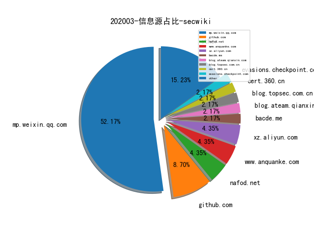
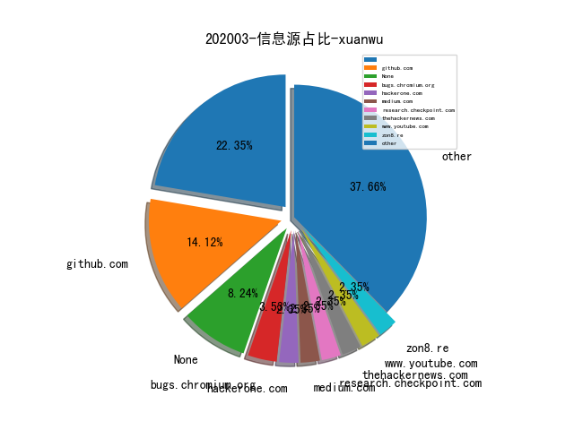
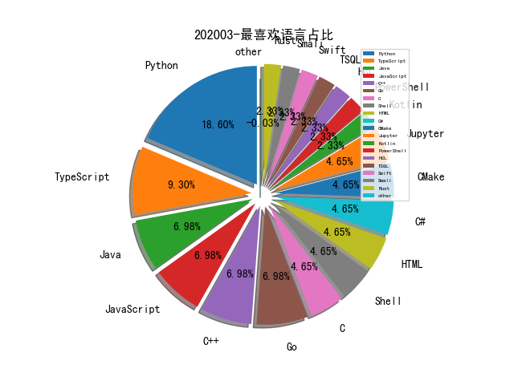

# [数据--所有](README_20.md)
# [数据--年度](README_2020.md)
# 202003 信息源与信息类型占比

# 微信公众号 推荐
| nickname_english | weixin_no | title | url| 
| --- | --- | --- | ---| 
| 青衣十三楼飞花堂 |  | burp pro 2020.2 | https://mp.weixin.qq.com/s/WXdEvc0p04KjyOlmb4qtRg | 1| 
| 安天 | Antiylab | 安天对“超高能力网空威胁行为体”系列分析回顾 | https://mp.weixin.qq.com/s/N0LxStDpc6GyzpyszYnguQ | 1| 
| 小议安全 | xiaoyianquan | 零信任架构远程办公实战 | https://mp.weixin.qq.com/s/Kgm0wuPeQHX7fJoUondz4Q | 1| 
| 永安在线反欺诈 | YongAnOnline | 业务安全蓝军测评标准白皮书 | https://mp.weixin.qq.com/s/23fcilR_XhrGLWSaKv21zA | 1| 
| Ms08067安全实验室 | Ms08067_com | Mr.Robot靶机 - 机器人先生 | https://mp.weixin.qq.com/s/-0EhntZSXvu4-xYQ89sPeQ | 1| 
| heysec | bloodzer007 | 完成一次渗透测试项目 | https://mp.weixin.qq.com/s/39wB8zLvda13p-sJytRa5w | 1| 
| SecWiki | SecWiki | 2020 Google夏日编程之安全项目列表 | https://mp.weixin.qq.com/s/Gf937RjTpA0QsT2DJFQRqQ | 1| 
| 大潘点点 | dapandiandian | 网安产业结构和动力分析——从合规型向能力型 | https://mp.weixin.qq.com/s/V6P-6X_fnw_kvHWMxtqwLg | 1| 
| 物联网IOT安全 | IOTsafety | Cobalt Strike｜从入门到入狱 | https://mp.weixin.qq.com/s/WAqgHn0DrXerEeow131w4Q | 1| 

# 组织github账号 推荐
| github_id | title | url | org_url | org_profile | org_geo | org_repositories | org_people | org_projects | repo_lang | repo_star | repo_forks| 
| --- | --- | --- | --- | --- | --- | --- | --- | --- | --- | --- | ---| 

# 私人github账号 推荐
| github_id | title | url | p_url | p_profile | p_loc | p_company | p_repositories | p_projects | p_stars | p_followers | p_following | repo_lang | repo_star | repo_forks | 
| --- | --- | --- | --- | --- | --- | --- | --- | --- | --- | --- | --- | --- | --- | ---| 
| alphaSeclab | DBI（Dynamic Binary Instrumentation：动态二进制插桩）逆向有关的资源收集 | https://github.com/alphaSeclab/DBI-Stuff | None |  | None | None | 17 | 0 | 38 | 288 | 0 |  | 1600 | 264 | 1| 
| zsdlove | 基于虚拟执行及污点跟踪的 Android 白盒审计系统 | https://github.com/zsdlove/Hades | None |  | None | None | 126 | 0 | 193 | 62 | 16 | Python,Java,Smali | 163 | 41 | 1| 
| google | FuzzBench - Fuzzer benchmarking as a service | https://github.com/google/FuzzBench | None | None | None | None | 0 | 0 | 0 | 0 | 0 | C,Shell,Java,Python,Kotlin,JavaScript,C++,TypeScript,HTML,Go,Rust | 0 | 0 | 1| 
| microsoft | 微软开源的支持 Checked C 版本的 clang 编译器 | https://github.com/microsoft/checkedc-clang | None | None | None | None | 0 | 0 | 0 | 0 | 0 | TypeScript,Java,C#,JavaScript,C++,Python,Go,CMake,TSQL,PowerShell,HCL | 0 | 0 | 1| 
| pyppeteer | pyppeteer2 - 用于控制 Headless Chrome 的 puppeteer 的 Python 移植版 | https://github.com/pyppeteer/pyppeteer2 | None | None | None | None | 0 | 0 | 0 | 0 | 0 | Python | 0 | 0 | 1| 

# medium_xuanwu 推荐
| title | url| 
| --- | ---| 

# medium_secwiki 推荐
| title | url| 
| --- | ---| 

# zhihu_xuanwu 推荐
| title | url| 
| --- | ---| 

# zhihu_secwiki 推荐
| title | url| 
| --- | ---| 
| 谈谈蜜罐（调研）与内网安全 | https://zhuanlan.zhihu.com/p/110886405| 

# 日更新程序
`python update_daily.py`